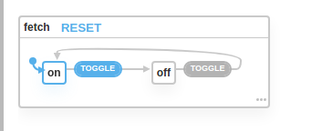

## Simple Finite State Machines in GO

> In computation theory, the Finite State Machine (FSM) are those machines that can have finite number of states at a given time. These machines are used in our daily life such as; vending machines, elevators, traffic lights etc. Not only in hardware these machines are used in software also...

More Description in this [Medium article](https://medium.com/wesionary-team/finite-state-machines-with-go-lang-ccd20e329a7b)

Learn more about finite state machines [here](https://xstate.js.org/docs/about/concepts.html#finite-state-machines)

Inspired from [@davidkpiano](https://github.com/davidkpiano) X-State library. (minimal finite state machine library in javascript) `@xstate/fsm`


Figure from xstate.js.org/viz/


```go
machine := statemachine.Machine{
    ID:      "machine-1",
    Initial: "on",
    States: statemachine.StateMap{
        "on": statemachine.MachineState{
            On: statemachine.TransitionMap{
                "TOGGLE": statemachine.MachineTransition{
                    To: "off",
                },
            },
        },
        "off": statemachine.MachineState{
            On: statemachine.TransitionMap{
                "TOGGLE": statemachine.MachineTransition{
                    To: "on",
                },
            },
        },
    },
}
output := machine.Transition("TOGGLE")
// output will contain state of the machine
// after sending TOGGLE event
```

##### Checklist

- [x] Implement basic finite state machine with transition
- [x] Add condition `cond` function calling to get the output.
- [x] Add multiple actions and call the function on state change.
- [x] Add state change listeners.  
- [x] Support for parallel state machines.
- [ ] Implement Parallel State machines state listeners.
